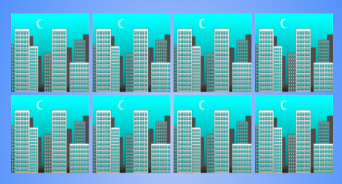

# Geo Memory

**Version 1.0.0**

Geo Memory is a regular memory game that allows the player to choose difficulty and level settings. 

## **Table of Contents**

1. [Features](#Features)
2. [Testing](#Testing)
3. [Technologies Used](#Technologies-Used)
4. [Deployment](#Deployment)
5. [Credits](#Credits)

---

## Features

- __Home Page Title Box__
    - The title box contains buttons that let's the player access the instructions, the leaderboard and start the game.

- __Instructions__

    - The instructions opens from the home page instructions button. 
    - Gives the user crystal clear instructions of how the game works and its rules. It explains in detail how the difficulties are applied and what they represent.

- __The Game Area__

    - The game area contains all relevant statistics all of which are generated through Javascript.
    - Timer
    - Score
    - Moves
    - The timer is based on the difficulty chosen by the player.
    - It displays the current level and difficulty.
    - It also displays the game board.

-__The Game Board__

    - The game board contains all cards.
    - The cards are generated through Javascript.
    - The amount of cards are based on the level.
    - All cards has a front and a back image.

-__Game Options__

    - The game options allow the player to choose difficulty and initial level

- __The Footer__

    - The footer is the same on every page of the site and always stays at below the game area.
    - The footer contains links to the developer's github page and linkedin page through the companies icons.

### Future Features

- Add more levels.
- Add the difficulty of matching country names with pictures.
- Add a leaderboard.
- Add extra columns to the game board when the space and card count allows.

## Media Queries
- Max-height: 1100px
    Change card dimensions through a css variable.
    Removes all modal padding.
    Change footer position to static.

- Max-height: 900px
    Change card dimensions through a css variable.

- Max Height: 500px 
    Change body and input font size.

- Max-width: 850px
    Change card dimensions through a css variable.
    Change grid gap.
    Change footer position to static.
    

- Max-width: 750px 
    Change grid column count.

- Max-width: 500px
    Change card dimensions through a css variable.
    Change modal footers to display block.
    
     

- Max-width: 320px
    Change card dimensions through a css variable.
    Change game title font size.
    Change difficuly class's font size.

# Testing
Testing is been done manually and have gone through all the features the site provides for all types of screens, from small to desktop screens. 

## User Features

### The Title Box Buttons
    - Instructions button: Works and opens up a modal and displays scrollable instructions.
    - Start Game button: Works and takes the user to the game page.

### Footer Icons 
    - Github icon: Works and opens a new tab that goes to the developer's github page.
    - LinkedIn icon: Works and opens a new tab that goes to the developer's linkedIn page.
    - All social media icons works as expected on all pages of the site.

### Instructions
    - The instructions scroll as intended.
    - Both close buttons work and closes the instructions.

### Game Options'
    - Displays a modal and the game options themseleves as default upon entering or refreshing the game page. 
    - The radio buttons are clickable and all have their corretly corresponding label.
    - They set the difficulty and level as intended once the game is started.
    - Start game button closes the modal and starts the game as intended.

### Difficulty Container'
    - Both the level and difficulty in the container recives the correct values from the game options.

### Info Container
    - Timer: Starts as intended when the game starts and decrements by one every second.
    - Score: Updates after two cards are flipped. It get incremented by 10 if correct and decremented by 2 if incorrect.
    - Moves: Works and increments by one after each card flip.

### Game Board
    - The page directs user focus to the board upon game start.
    - After the game is started the correct amount of cards are created and added randomly to the game board.
    - Two new pairs of cards and a new row is added for each level as intended.
    - A minimum of four columns is always displayed upon game start.

### Cards
    - The cards resize upon hovering.
    - All cards on the board are clickable.
    - All cards flip over when clicked.
    - A flipped card can't be clicked again.
    - It recognizes when two cards match or don't match.
    - When two cards are flipped and are not correct the turn back after the time set by the difficulty or turn back upon a click of a new card.
    - When two cards are flipped and are correct they stay flipped and never flips back, while still alowing for new cards to be flipped and checked.

### Game Over Modals
    - All modals display the correctly calculated scores and statistics.
    - All close buttons closes the modals and takes the user back to the home page.
    - The play again and next level buttons work as intended and refreshes the page.
    - Upon a game win the game win modal is displayed.
    - Upon a game lose the game lose modal is displayed.
    - Upon beating the game the game over modal is displayed.

### Exit/Reset Buttons 
    - The exit button works and takes the user back to the home page.
    - The restart button works and refeshes the game page.

### Buttons
    - All buttons hover as intended.
    - All non-"X" buttons focus when clicked
## Screen Responsivnes
    - I tested the all pages of the site on all different devices that exist on https://responsivedesignchecker.com/.
    - Some elements and screen sizes needed to be media queried that I would have forgoten about otherwise.
    - Responsiveness at this time is satisfactory.

## Validator Testing

- HTML
    - No errors were returned when passing through the official [W3C validator](https://validator.w3.org/nu/?doc=https%3A%2F%2Frobingjonsson.github.io%2FGeo-Memory%2F)

- CSS
    - No errors were found when passing through the official [Jigsaw validator](https://jigsaw.w3.org/css-validator/validator?uri=https%3A%2F%2Frobingjonsson.github.io%2FGeo-Memory%2F&profile=css3svg&usermedium=all&warning=1&vextwarning=&lang=en)

- JS
    - Functions declared in within loops errors were found on three occasions when passing through the official [JSHint validator](https://jshint.com/)
    
    - These errors are due to adding event listeners inside of a function. But as far as I know this is the best way to go about it anyway.

### Bugs

    - There are no known bugs.

### Solved Bugs

    - Instructions content is to long to show all of it, and overflows from the viewport and didn't scroll.
    - I had put a min-height on the modal it sits on, so by changing it to just height solved the problem.

## **Technologies Used**

- [Gitpod](https://gitpod.io/)
- [Github](https://github.com/)
- [Fontawesome](https://fontawesome.com/start)
- [W3C](https://validator.w3.org/#validate_by_input)
- [JSHint](https://jshint.com/)
- [Jigsaw](https://jigsaw.w3.org/css-validator/)
- [SimpleImageResizer](https://www.simpleimageresizer.com/)

## Deployment

The project was deployed on GitHub Pages. I used Gitpod as a development environment where I commited all changes to git version control system.
I used push command in Gitpod to save changes into GitHub.

    - The site was deployed to GitHub pages.
    - I logged into github
    - In the GitHub repository, I went to the Settings tab.
    - From there I clicked the Pages section and cliked the source drop down menu called Branch and selected main.
    - Once the master branch has been selected, the page will be automatically refreshed 

The live link can be found here - https://robingjonsson.github.io/Geo-Memory/

To run localy:
- Log in to GitHub and click on repository to download
- Select `Code` and click Download the ZIP file.
- After download you can extract the file and use it in your local environment 

## Credits

### Content

- The ShuffleCards function is the Fisher Yates algorithm that I found on https://www.geeksforgeeks.org/shuffle-a-given-array-using-fisher-yates-shuffle-algorithm/
- All icons on the page were taken from [Font Awesome](https://fontawesome.com/)

### Media

- Back of cards image: https://www.pinterest.es/pin/405183297723217911/
- Malmö Sweden Image: https://www.pexels.com/photo/monochrome-photo-of-the-turning-torso-skyscraper-5899438/
- New York USA Image: https://www.pexels.com/photo/buildings-with-lights-at-nighttime-472037/
- Sydney Austrailia Image:https://www.pexels.com/photo/sydney-opera-house-australia-1878293/
- Moscow Russia Image: https://www.pexels.com/photo/saint-basil-s-cathedral-753339/
- Agra India Image: https://www.pexels.com/photo/taj-mahal-and-the-four-minarets-1603650/
- Dubai United Arab Emirates Image: https://www.pexels.com/photo/blue-and-gray-high-rise-building-162031/
- Paris France Image:https://www.pexels.com/photo/photo-of-cars-parked-on-side-of-street-across-the-eiffel-tower-3182530/
- Rome Italy Image:https://www.pexels.com/photo/administration-ancient-arches-architecture-356966/
- London England Image: https://www.pexels.com/photo/bridge-over-river-in-city-258117/
- Athens Greece Image: https://www.pexels.com/photo/ruins-of-a-temple-with-ancient-architectural-design-6336038/